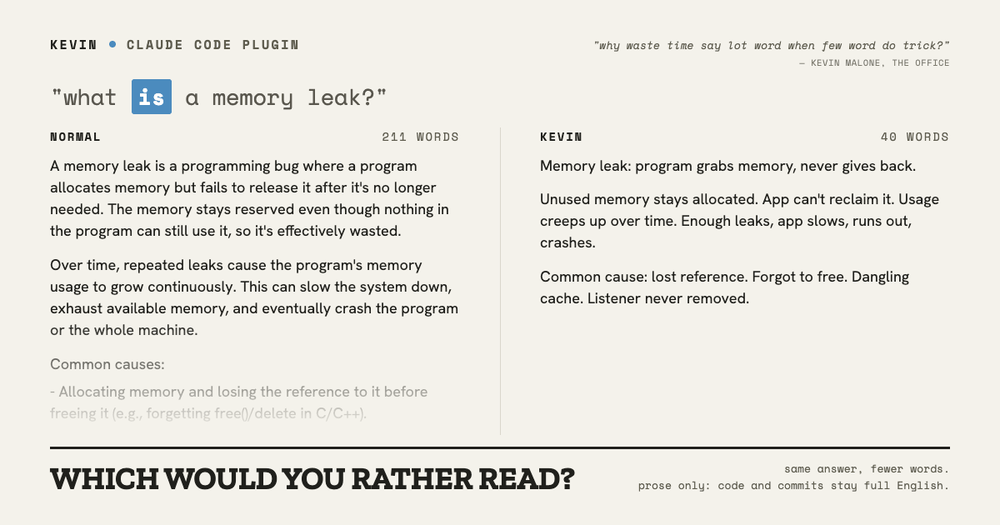
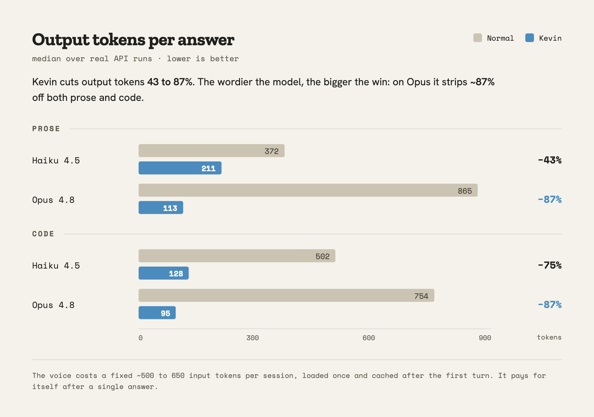
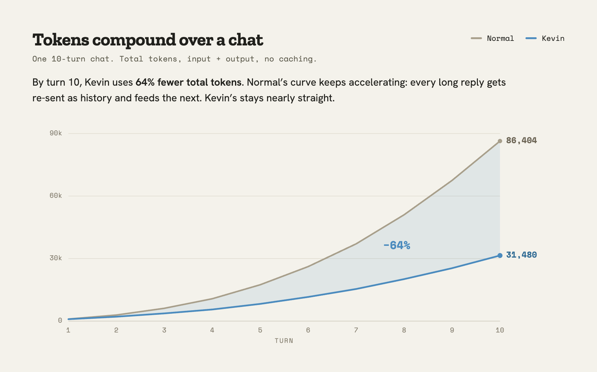

# kevin

Talk like Kevin from The Office. Fewest words that still carry the meaning.

> "Why waste time say lot word when few word do trick?"

Kevin Malone said that to defend the way he talks, and he had a point. Most of what an AI assistant types back at you is padding: throat-clearing, hedges, restating your own question, three sentences where one would do. Kevin is a Claude Code plugin that strips it out. You get the answer, not the essay.

It governs prose only. Chat replies, summaries, explanations. It leaves code, commit messages, and anything that ships under a real name completely alone.

## Before / after

<a href="examples.md">
  <picture>
    <source media="(prefers-color-scheme: dark)" srcset="docs/before-after-dark.png">
    
  </picture>
</a>

Real captures, same prompt with and without Kevin. [See 30 more.](examples.md)

What Kevin won't touch: code, commit messages, PR descriptions, and security or destructive-action warnings stay in full, plain English. Compression is for the chat, not for the things you read back later under your name.

## Why this exists, and why it isn't really about tokens

Every compression tool in this space sells token savings. Kevin saves tokens too (numbers below), but that's not the reason to run it.

Tokens are cheap. A long-winded Opus answer costs a fraction of a cent. The resource you're actually spending is your own attention, reading the same preamble for the hundredth time today. That cost never shows up on an invoice, which is exactly why it's the one worth cutting. Kevin optimizes for your reading time. The API bill is an afterthought.

This is also where it splits from caveman and the other token-golfers. They win tokens by breaking grammar: "me fix bug, code good now." It compresses, but you slow down to decode it. Kevin keeps real words and real sentence shape and just uses far fewer of them. It reads like a terse human, not a cave painting. The point is to cut the time you spend reading, not to trade readability for a smaller token count.

The token savings are a side effect. A good one.

## The savings

<picture>
  <source media="(prefers-color-scheme: dark)" srcset="docs/savings-dark.png">
  
</picture>

## It compounds over a chat

<picture>
  <source media="(prefers-color-scheme: dark)" srcset="docs/compounding-dark.png">
  
</picture>

A single answer understates it. The API is stateless, so the whole transcript rides along on every turn. Kevin's shorter replies keep that history lean, and the gap widens turn over turn. These are raw token counts; with caching the cost gap holds up, just driven by Kevin's shorter output rather than the smaller history.

## How it works

A single SessionStart hook prints `kevin-voice.md` as hidden session context, so the persona loads on every startup, resume, clear, and compact. No state file, no background process. Turn it off mid-session by saying "stop kevin" or "normal mode"; the model honors it, it isn't a setting.

`kevin-voice.md` is the single source of truth. The hook and the benchmark both read it.

## Install

Add the marketplace:

```
/plugin marketplace add grepsedawk/kevin
```

Then install the plugin:

```
/plugin install kevin@kevin
```

## Benchmarks

Reproduce the charts:

```
python3 -m pip install anthropic
ANTHROPIC_API_KEY=... python3 benchmarks/run.py       # per-answer savings
ANTHROPIC_API_KEY=... python3 benchmarks/session.py   # 10-turn compounding
```

`run.py` reports the output-token delta split into prose and code buckets. `session.py` runs one scripted conversation through both arms and records per-turn and cumulative tokens. Set `KEVIN_BENCH_MODEL` to test another model; `run.py` also takes `KEVIN_BENCH_TRIALS` (default 5).

## License

MIT. See [LICENSE](LICENSE).
